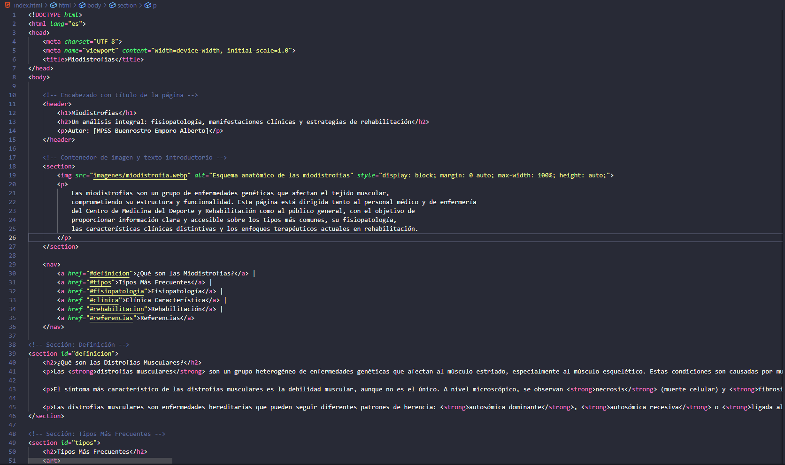

# Proyecto de Página Web

## Objetivos de Aprendizaje
El objetivo principal de este proyecto es crear una página web sencilla utilizando HTML y recursos multimedia como imágenes. Los objetivos específicos incluyen:

- Aprender y aplicar los conceptos básicos de HTML para estructurar el contenido web.
- Utilizar Git y GitHub para gestionar el código y realizar el control de versiones.
- Integrar imágenes y recursos multimedia en una página web estática.

## Herramientas Utilizadas
- **Visual Studio Code**: Editor de código fuente utilizado para el desarrollo de la página web.
- **Git**: Sistema de control de versiones utilizado para gestionar el código fuente y hacer seguimiento de los cambios.
- **GitHub**: Plataforma para almacenar el proyecto y facilitar su colaboración.
- **Imágenes**: Recursos visuales utilizados para enriquecer el contenido de la página web.

## Descripción del Proyecto
Este proyecto consiste en una página web estática que utiliza HTML para estructurar el contenido y mostrar imágenes.

